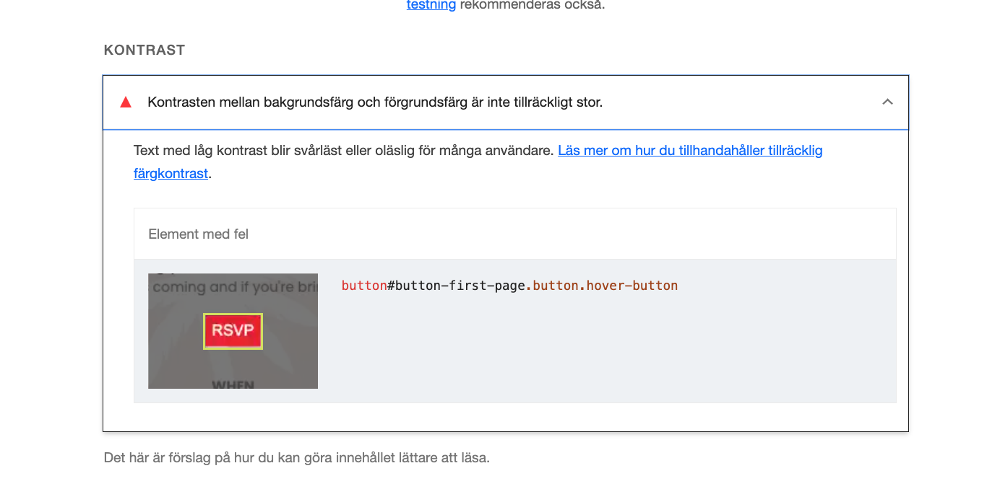

<h1 align="center">Event invitation site for XOXO Publishing's launch cocktail party</h1>

[View the live project here.](https://ceciliasg.github.io/pp1_cocktail_evening/index.html)

This is an invitation website for XOXO Pulishings Cocktail Event Launch Party. Guests will be invited either via email or invitations sent by post. In the email there will be a link to the site and in the posted invitation the site address will be included. The purpose of the site is to let guest now what, when and where - and to make the RSVP-process simple.

<h2 align="center"></h2>

## User Experience (UX)

- ### User stories

- #### First Time Visitor Goals

        1. As a First Time Visitor, I want to easily understand the main purpose of the site, get information about the launch party and rsvp.
        2. As a First Time Visitor, I want to be able to easily navigate throughout the site to find content.
        3. As a First Time Visitor, I want to find information about how I can contact the organisers.
        4. As a First Time Visitor, I want to find address and how to get to the venue/party.

- #### Returning Visitor Goals

        1. As a Returning Visitor, I want to find information about how to RSVP.
        2. As a Returning Visitor, I want to find the best way to get in contact with the company with any questions I may have.
        3. As a Returning Visitor, I want to find social media links for the company.
        4. As a Returning Visitor, I want to find how to get to the party/venue.


- ### Design

- #### Colour Scheme
  
- Two main colours, pink and red,complemented by white - used mainly for background and some text, and a purple colour for the footer and hover.

- #### Typography

- Poppins and Libre Baskerville, both webfonts that generally work well across different browsers.
  
- #### Imagery
  
- For this website the main focus is information, letting visitors know what, when and where for the event and how to RSVP, so the illustrations are added to making the feeling of the site more fun.

- ### Wireframes

  - Home Page Wireframe
  
  

  - Mobile Wireframe
  
  

  - RSVP Page Wireframe  
  
  

## Features

- Responsive on all device sizes.

- Interactive elements: button, links, rsvp-form, radio-buttons, drop-down menu, Google map.

### Languages Used

- [HTML5](https://en.wikipedia.org/wiki/HTML5)
- [CSS3](https://en.wikipedia.org/wiki/Cascading_Style_Sheets)

### Frameworks, Libraries & Programs Used

1. [Google Fonts:](https://fonts.google.com/)
    - Google fonts were used to import the 'Libre askerville' and 'Poppins' font into the style.css file which is used on all pages throughout the project.
2. [Font Awesome:](https://fontawesome.com/)
    - Font Awesome was used on all pages throughout the website to add icons for aesthetic and UX purposes.
3. [Git](https://git-scm.com/)
    - Git was used for version control by utilizing the Gitpod terminal to commit to Git and Push to GitHub.
4. [GitHub:](https://github.com/)
    - GitHub is used to store the projects code after being pushed from Git.
5. [Photoshop:](https://www.adobe.com/ie/products/photoshop.html)
    - Photoshop was used to change colour of images.
6. [Canva:](https://www.canva.com)
    - Canva was used to create the sketches during the design process.

## Testing

The W3C Markup Validator and W3C CSS Validator Services were used to validate every page of the project to ensure there were no syntax errors in the project.Lighthouse was used to check the project for accessability.

- [W3C Markup Validator](https://jigsaw.w3.org/css-validator/#validate_by_input) - No errors were returned when passing through the official W3C validator.
[Results RSVP-page](https://validator.w3.org/nu/?doc=https%3A%2F%2Fceciliasg.github.io%2Fpp1_cocktail_evening%2Frsvp.html)- [Results Where-page](https://validator.w3.org/nu/?doc=https%3A%2F%2Fceciliasg.github.io%2Fpp1_cocktail_evening%2Fwhere.html)- [Results Home-page](https://validator.w3.org/nu/?doc=https%3A%2F%2Fceciliasg.github.io%2Fpp1_cocktail_evening%2Findex.html)
- No errors were found when passing through the official W3C CSS Validator (https://jigsaw.w3.org/css-validator/#validate_by_input) - [Results](http://jigsaw.w3.org/css-validator/validator$link)
- Lighthouse testing:
On the first runthrogh the testing indicated a issue with the colours of the RSVP-button.



The font-color was changed black, and below are the new test results.

- Results desktop:
- Results mobile:

### Feature Testing

| Feature       | Test case        | Outcome |
| ------------- |:-------------| :-----|
| Logo| Click logo  |  User is returned to the Home page  |
| RSVP-button | Clicked| Takes user to the RSVP-page |
| RSVP-form   |    Filled in and sent|   Can be filled in and sent. Can only be sent with the required information. |
| Navbar | Test links     |    Links work and take us to the correct page.|
| Drop-down | Test drop-down and links     |    Drops-down when clicked, and the links takesuser to the correct page. |
| Google map| Address, enlargement and zoom.   |    Correct address is marked and the map can be enlarged. Zoom works.  |
| Footer-links| Click Fontawsome icons   |    Links to Instagram and the email icon opens the emial program.  |

#### Exisiting Features

##### RSVP-button

- Featured on the Home page.
- Can be clicked to take the user directly to the RSVP-page with the RSVP-form.
- Makes it easy and quick for users to go to the RSVP-form and send there info.


##### RSVP-form

- Featured on the RSVP-page.
- A form with required field that can only be sent when filled in correctly. A radio-button also has to be shosen for validation to work.
- Lets users easily send their RSVP for the party.
  
  

##### Navbar

- Featured on all three pages.
- The fully responsive navigation bar includes links to the logo, Home page, RSVP-page and Where-page.
- This section lets users easily navigate across the site without having to return to the Home page in between.


##### Drop-down menu

- Featured on all three pages on mobile and tablet devices.
- The fully responsive dropdown menu/navigation includes links to the Home page, RSVP-page and Where-page.
- This feature makes iteasy for users to get to the other pages when viewing the site on mobile and tablet devices.


##### Google map

- Featured on the Where-page.
- The fully responsive Google map shows users where the venue is located.
- Makes it easier for users (guests) to find their way to the party.


#### Footer-links

- This section includes a link to Instagram, and an email link that will open the users email program.
- Makes it easy for usersto visit the comapnies Instagram page and send an email to to company.


  
### Further Testing

- The Website was tested on Google Chrome, Firefox and Safari.

| Browser tested     | Intended appearance| Inteded responsiveness|
| :------------- |:-------------| :-----|
|  Chrome  |   Good | Good    |
| Firefox    | Good      |  Good |
| Safari | Good      |    Good |

- Responsiveness testing

| Device tested    | Site responsiveness <699px| Renders as expected|
| :------------- |:-------------| :-----|
|  Iphone 10 |   n/a | Good    |
| Tablet   | n/a    |  Good |
| Laptop  | Good      |    Good |


- The website was viewed on a variety of devices such as Laptop and iPhone 10.
- Testing was done to ensure that all pages were linking correctly.
- Family members were asked to review the site and documentation to point out any bugs and/or user experience issues.


## Deployment

### GitHub Pages

The project was deployed to GitHub Pages using the following steps...

1. Log in to GitHub and locate the [GitHub Repository](https://github.com/)
2. At the top of the Repository (not top of page), locate the "Settings" Button on the menu.
    - Alternatively Click [Here](https://raw.githubusercontent.com/) for a GIF demonstrating the process starting from Step 2.
3. Scroll down the Settings page until you locate the "GitHub Pages" Section.
4. Under "Source", click the dropdown called "None" and select "Master Branch".
5. The page will automatically refresh.
6. Scroll back down through the page to locate the now published site [link](https://github.com) in the "GitHub Pages" section.

### Forking the GitHub Repository

By forking the GitHub Repository we make a copy of the original repository on our GitHub account to view and/or make changes without affecting the original repository by using the following steps...

1. Log in to GitHub and locate the [GitHub Repository](https://github.com/)
2. At the top of the Repository (not top of page) just above the "Settings" Button on the menu, locate the "Fork" Button.
3. You should now have a copy of the original repository in your GitHub account.

### Making a Local Clone

1. Log in to GitHub and locate the [GitHub Repository](https://github.com/)
2. Under the repository name, click "Clone or download".
3. To clone the repository using HTTPS, under "Clone with HTTPS", copy the link.
4. Open Git Bash
5. Change the current working directory to the location where you want the cloned directory to be made.
6. Type `git clone`, and then paste the URL you copied in Step 3.

```
git clone https://github.com/YOUR-USERNAME/YOUR-REPOSITORY
```

7. Press Enter. Your local clone will be created.

```
$ git clone https://github.com/YOUR-USERNAME/YOUR-REPOSITORY
> Cloning into `CI-Clone`...
> remote: Counting objects: 10, done.
> remote: Compressing objects: 100% (8/8), done.
> remove: Total 10 (delta 1), reused 10 (delta 1)
> Unpacking objects: 100% (10/10), done.
```

Click [Here](https://help.github.com/en/github/creating-cloning-and-archiving-repositories/cloning-a-repository#cloning-a-repository-to-github-desktop) to retrieve pictures for some of the buttons and more detailed explanations of the above process.

## Credits

### Code

- The base code for the header, nav and dropdown menu came from Love Running project but was modified to better fit the design of the site.

- The base code for the form came from the the Love Running project but has been modified to fit the design of the site. Instructions on how to implement form validation was taken from the instructions in the Love Running project.

- Solution on how to target a background image added in css on a specific page, came from [Stackoverflow] (<https://stackoverflow.com/>)
- My mentor helped me to figure out how to fix the problem with image sizing on the where page by applying background-size: contain;
- My mentor pointed out that I should make the phone number in the footer a link.
- My mentor helped me with the button on the Home-page that threw up an error in the HTML testing. Code from jsfiddle.net.

### Content

- All content was written by the developer.

### Media

- Images were downloaded from [PNG Tree](https://pngtree.com/).
- The Icons in the footer was taken from [FontAwesome] (https://fontawesome.com/).

### Acknowledgements

- My Mentor for continuous helpful feedback.
